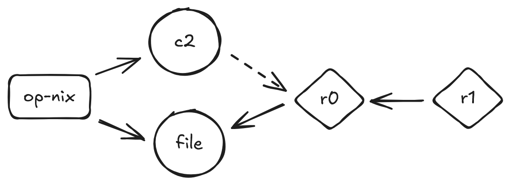

## Quick Start
Suppose we want to deploy an infrastructure composed of five machines.

This is a simple example: we choose Sliver as the C2, Caddy as the redirector, one operators machine and decide to use a Payload server (PWNDROP exposed only via vpn). Every internal connection will be managed through ZeroTier (VPN). Essentially, every legitimate packet reaching the outermost redirector will only pass through the ZeroTier VPN.



At this point, we should evaluate the resources we can use for our goals. Ideally, these infrastructures should not be cloud-centric. Only certain elements should leverage cloud structures but this decision is left to your discretion.

Assuming we have the IP addresses of the deployed machines directly available, we can skip the Terraform deployment step and proceed with the following configurations

### Hosts Configuration

Create your inventory file by modifying file `hosts.yml`, the goal is to assign each machine an IP address that we have available.

### Playbook Configuration

1. The main playbook is located at `playbooks/main.yml`.

2. Based on the schema, assign the required roles to each machine. Since we are using ZeroTier as the VPN service, we will use this to route traffic between the redirectors and the C2 server. In this scenario, the configuration file is already prepared inside `playbooks/main.yml` and, in case you need some changes, please read the comments inside it.

### Running the Infrastructure

When you are ready, you can run the command:

```bash
ansible-playbook -i hosts.yml playbooks/main.yml
```

## Custom Configurations

- You can modify tool lists in `playbooks/files/*.txt`.
- Configure specific service settings in their respective role directories, such as `redirector` configuration files.
- **BONUS**: When using Terraform, restrict access with `firewall.tf`. For instance, you can allow access only from your ZeroTier subnet for SSH or HTTP.
- **Note**: This setup is not "engagement ready," so be prepared to adjust configurations to suit your specific requirements.